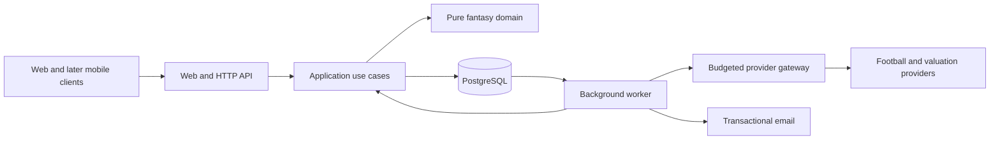

# Architecture baseline

Accepted under the user's delegated decision instruction on 2026-09-18, preserving prior ADRs. The first domain calculations and PostgreSQL transaction/job proof now exist; see [slice 01](implementation-slice-01.md). The rest is selected implementation design, not completed integration.

## Runtime and ownership

Use one modular application, with a Next.js participant/admin web and versioned HTTP API in apps/web, plus an independently runnable Node worker in apps/worker. PostgreSQL is the system of record and hosts pg-boss jobs. Kysely supplies typed SQL queries over pg; immutable PostgreSQL migrations define integrity constraints and locking remains explicit. This replaces the initial Drizzle choice after strict declaration compatibility checks ([ADR 0015](adr/0015-typed-sql-with-kysely.md)). Zod validates network/configuration boundaries, with types inferred from schemas. Better Auth handles identity/session mechanics and Resend transactional mail. Redis and separate API deployment are not launch dependencies.

Next.js supports self-hosting; protect the Node service behind a reverse proxy and configure cache behavior deliberately. Authenticated or competitively sensitive state must never leak through a shared page cache. See [official self-hosting guidance](https://nextjs.org/docs/app/guides/self-hosting).

pg-boss supports PostgreSQL jobs and transactional enqueue; adopt it to avoid another durable system. Handlers still need idempotency because retries and external effects can repeat. Verify chosen pinned versions and transaction integration in a spike, rather than treating a queue's delivery claim as end-to-end exactly-once behavior. See [pg-boss](https://github.com/timgit/pg-boss) and [Kysely](https://kysely.dev/docs/intro).

## Code boundaries

| Location                   | Responsibility / dependency rule                                                                                                    |
| -------------------------- | ----------------------------------------------------------------------------------------------------------------------------------- |
| apps/web                   | UI, routing, HTTP/session adapters, composition; no independent scoring implementation.                                             |
| apps/worker                | Job handlers, schedule, composition; same application use cases for common behavior.                                                |
| packages/domain            | Pure rules, validation decisions, points, prices, transfers and lifecycle calculations; no database, framework or provider imports. |
| packages/contracts         | Runtime request/response schemas, generated OpenAPI and client types for versioned HTTP boundaries.                                 |
| packages/application       | Commands/queries and transaction orchestration; capability checks and declared ports at actual infrastructure boundaries.           |
| packages/persistence       | Kysely table types, SQL migrations, transactions, concrete query implementation; owns SQL integrity constraints.                    |
| packages/integrations      | Provider normalization, email and external adapters; raw responses start as unknown.                                                |
| packages/typescript-config | Existing strict compiler policy.                                                                                                    |

Create these packages as the first consuming slice needs them. Do not create a package/service per entity, a generic repository hierarchy, or duplicate schema/type definitions by hand. UI reuse begins inside apps/web; extract a UI package only with a second real consumer.

Module owners inside application: football data owns identities/facts/overrides; competitions owns configurations/assignments; entries owns roster/bank/transfers/chips; scoring owns result calculation; standings owns rank/H2H projections; awards owns prizes/achievements; community owns chat/moderation; sponsors owns campaigns. Modules invoke explicit use cases or consume revisioned results rather than writing another owner's tables.

## Transaction boundaries

- Entry creation and cap changes share a competition admission lock; recheck registration time, account entry count and target deadline in the transaction.
- Entry commands lock the entry, verify ownership/expected revision, validate a bounded command and use database wall-clock time at the acceptance write. PostgreSQL transaction-start time must not grant a request eligibility after waiting for a lock. Accepted-at must be strictly before cutoff and written atomically with state/ledger. Return success only after commit. A pre-cutoff accepted write that commits afterward is eligible; a rollback is not accepted.
- Snapshot creation and late workers use those committed accepted revisions. A worker's delayed flag cannot extend a deadline; use the same lock order to wait for in-flight accepted transactions. Every command names its round.
- Price-batch publication and transfers coordinate their price revision checks transactionally. A transfer cannot validate against one price and debit another.
- Unique idempotency keys scoped by actor/command retain a request fingerprint and result. Same key/different body fails; a lost response can safely return the committed outcome.
- State changes and dependent job enqueue share one PostgreSQL transaction using the verified pg-boss adapter. If that integration cannot be proven, use a small transactional outbox with deduplicated dispatch; never two unrelated commits.
- Recalculation writes a complete staged revision, then atomically advances a publication pointer. Queries pin that revision; award approval checks it under lock.
- Provider attempts reserve durable quota before network I/O, outside long database locks. Uncertain attempts remain charged; publication processing is independent of request accounting.

These choices require integration races/failure injection, not just unit mocks. Read [PostgreSQL locking semantics](https://www.postgresql.org/docs/current/explicit-locking.html) when implementing them.

## Contracts and evolution

HTTP /api/v1 carries stable IDs, explicit units, UTC instants, locale-independent values, revision/cursor metadata and structured errors. Mutation errors distinguish closed deadline, stale revision, insufficient budget, invalid selection and denied access. Validate responses as well as requests where trust boundaries require it. Web server-rendered reads may invoke the same queries directly; native compatibility must not depend on private Next.js server-action serialization.

Use discriminated result/lifecycle types and exhaustive handling. External IDs are unique only within provider namespace; map to internal stable IDs. Keep raw source snapshots and normalization versions separate from canonical facts, overrides and game results. Current tables plus purpose-specific ledgers/snapshots are sufficient; do not event-source the entire application.

Migrations use expand/backfill/contract with rollback-compatible releases. Introduce indexes from query plans and measured workload. Extraction into services later requires a demonstrated deployment/scale need; module ownership and contract tests provide the seam without premature network boundaries.

## Verification and selected libraries

The repository pins the compatible Node/pnpm/TypeScript/ESLint toolchain, tested pg/pg-boss/Kysely dependencies and the Next.js/React/Zod/Better Auth application libraries. Slice 01 records the queue declaration compatibility finding; ADR 0015 records the database query-tool change. Better Auth supplies a [2FA plugin](https://better-auth.com/docs/plugins/2fa), but session binding and staff MFA remain application work. Selecting a library does not implement its policy.

Use Node's test runner for pure TypeScript-domain build tests initially, database integration tests against disposable PostgreSQL, and Playwright for bilingual user/admin journeys when apps exist. Avoid mocking SQL races. See [delivery plan](delivery-plan.md) for gates and [operations](operations.md) for capacity and restore targets.
